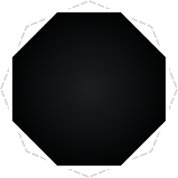

# 💫 About Me:
📠M.Sc. Telecommunications Engineering & Cybersecurity 🔭 Currently working on Security & Resiliency @ Kyndryl France 👯 Looking to collaborate on interesting projects 🌱 Currently learning about AI & Cybersecurity

## 🌐 Socials:

  
  
  

# 💻 Tech Stack:
           
# 📊 GitHub Stats:
 
 

---

<!-- Proudly created with GPRM ( https://gprm.itsvg.in ) -->

